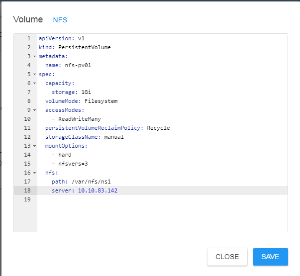

Your Friendly Neighborhood Kubernetes-Helm-Prometheus Console
=============================================================

This is a web app to quickly install Helm charts/apps just by search and click from the official Artifact Hub.

The main functionality of this console includes:

-   Add and manage bare metal Kubernetes clusters via an easy interface using the all mighty Kube REST-API.

-   View/manage Kubernetes resources: Nodes, Pods, Services, Deployments, Secrets, Volumes, and Volume-Claims.

-   An SSH based Helm interface to list, add and update Helm repos.

-   Install Helm apps by search and click from the Artifact Hub.

-   View cluster metrics via graphical dashboards by deploying Prometheus.

-   Other cool stuff I forgot.

Adding Kubernetes Clusters
==========================

In the dashboard menu click *Kubernetes \> Clusters View* and click *Add*.

Fill the cluster information:

-   Name: Cluster name

-   API Server: Kubernetes API server: https://HOST:6443

-   SSH Info: An account in the remote server is required to manage HELM.

**Tip:** Fill the SSH info and click *Access Token* to fetch the token from the remote API server. **The very first time you add a cluster check *Grant cluster resource access* to be able to view resources such as nodes, pods, services, etc**.

Easily Install Apps from Artifact Hub
=====================================

After you add a cluster, click *Kubernetes \> Apps View* and type a name in the search box, for example type “apache” to view an HTTP server.

A suggestion box using *Twitter Typeahead* should pop up with available hub apps. From there you can install, view details, or perform advanced installations.

Advanced Installation using YAML or Parameters
==============================================

Besides a quick install you can perform advanced installations using YAML or app parameters. For example, to install and HTTP server type “apache” in the search box and click ADVANCED.

-   To install using YAML select YAML and click fetch to extract the default YAML from the HELM chart then modify at your leisure.

-   To install using parameters, select *Text* and type the installation parameters. Use the Hub app details to view chart configuration parameters.

Metrics Dashboards using Prometheus
===================================

The web console can display dashboards of your cluster metrics using Prometheus. This section shows you how easy this is:

1.  In the main menu Click *Kubernetes \> Apps View.*

2.  In the search box at the top type *Prometheus*, the selection box will pop up, then click ADVANCED on the Prometheus community chart. 

3.  In the advanced dialog type the following installation parameters the click Install.

server.service.type=NodePort,alertmanager.service.type=NodePort,alertmanager.persistentVolume.enabled=false,server.persistentVolume.enabled=false

**Note:** The parameters above install Prometheus using node ports (so it is accessible outside the cluster) and disable the persistent volume claims.

Click in the Prometheus card to open its console and copy the HOST:PORT URL.

Add a Prometheus Data Source
----------------------------

Click *Configure \> Data Sources* then add and save:

-   Type: Prometheus.

-   Name: Kube1 (use this name to view the sample dashboards).

-   Description: Type a description.

-   Base URL: The URL you extracted in the previous section: **https://HOST:PORT**

**Tip:** Make sure the URL is correct (do not include context paths); after saving, start the data source or restart the node from the Home page. Next click *Dashboards \> Editor*.

Add a Dashboard
---------------

**Tip:** Click View on any of the sample dashboards in the dash editor:

Missing Persistent Volume Claims: The most common installation problem
======================================================================

Most of the HELM Apps out there use volume claims to store data, if your cluster has no cloud storage the install will fail with *pending* pods. In this section will show you how to use the console to quickly create an NFS volume claim to install your apps.

Install NFS in your Host
------------------------

Follow this guide to install NFS in your API server <https://www.itzgeek.com/how-tos/linux/centos-how-tos/how-to-setup-nfs-server-on-centos-7-rhel-7-fedora-22.html>

Here is a sample of the NFS /etc/exports in the API server of my internal cluster:

/var/nfs/ns1 \*(rw,sync,no\_root\_squash,no\_all\_squash)

/var/nfs/ns2 \*(rw,sync,no\_root\_squash,no\_all\_squash)

/var/nfs/ns3 \*(rw,sync,no\_root\_squash,no\_all\_squash

**Tip:** Install NFS: sudo yum install -y nfs-utils, Reload exports: sudo exportfs –r , Start NFS: sudo systemctl start nfs-server

Create an NFS Volume and Volume Claim
-------------------------------------

Click *Kubernetes \> Clusters View \> Your Cluster* to view its resources. In the *Persistence* tab click *Add Volume* from the top right menu:

Click the NFS sample link and add and save:

-   NFS Path: A path you just created in the previous step. For example: /var/nfs/ns1

-   NFS Server: IP address of your NFS server.

Next add a volume claim. Note: Claims are bound to a namespace. Make sure the status of the volume/claim is **bound** in the console.

**Tip:** Now you are ready to install any HELM App that uses a Volume Claim. You just have to set the claim name to nfs-pvc01 (in this case) in its YAML using the ADVANCED installation. **Watch out for NFS share file permissions (they can be a real headache)**.

Use the Event View for Troubleshooting
--------------------------------------

If an app fails to start the events view in the console can tell you exactly what is going on.

In the view above there is an NFS mount failure with persistent volume **nfs-pv01**:

MountVolume.SetUp failed for volume "nfs-pv01" : mount failed: exit status 32 Mounting command: systemd-run Mounting arguments: --description=Kubernetes transient mount for /var/lib/kubelet/pods/bb6e0d5c-3dc0-4183-a5e7-13f10b421b47/volumes/kubernetes.io~nfs/nfs-pv01 --scope -- mount -t nfs -o hard,nfsvers=3 10.10.83.142:/var/nfs/ns1 /var/lib/kubelet/pods/bb6e0d5c-3dc0-4183-a5e7-13f10b421b47/volumes/kubernetes.io~nfs/nfs-pv01 Output: Running scope as unit run-22062.scope. mount: wrong fs type, bad option, bad superblock on 10.10.83.142:/var/nfs/ns1, missing codepage or helper program, or other error…

**Tip:** In this case the issue was a missing NFS client in the cluster worker nodes.

Image Download Secrets: Another Common Installation Headache
============================================================

A secret may be required to authenticate and download private images from registries like GCR. You can easily manage secrets from the Secrets tab of the Kubernetes manager page. In the top right menu, click *Add Secret*:

| Key                                   | Value                                          |
|---------------------------------------|------------------------------------------------|
| Name                                  | Regcred (Secret name)                          |
| Namespace                             | Default (or whatever)                          |
| Type                                  | kubernetes.io/dockerconfigjson (required)      |
| Data .dockerconfigjson (required key) | Your docker authentication configuration JSON. |

***Tip:** Click the GCR link to fill the common blanks.*

**Tip: On the first time you setup the regcred secret, check the box *Patch image pull secret for service account “default”*.** This will bind the secret as the default image pull secret for the *default* service account enabling download of any private image from GCR. Click save then proceed to install your private registry charts. If you make a mistake here, images will not download *(look for errors in the events view)*.

Other Goodies
=============

There are plenty of goodies in the console to help you manage your cluster including:

-   POD Logs: From the management view you can inspect, check the status, and monitor container logs and more.

-   SSH Access to containers or nodes via the slick XTerm.js

-   Inspect Kube resources: Nodes, PODS, services, secrets, volumes, and volume claims.

Building and Installation
=========================

Import the projects using your Eclipse workbench. Each module is built as a separate project and includes an Ant build script.

1.  Build the WebConsole web archive (WAR) project using either the workbench or ant script.

2.  Deploy the WAR to your Tomcat or other J2EE container then browse to http(s)://HOST:8080/WebConsole/.

License
=======

[Apache License 2.0](https://www.apache.org/licenses/LICENSE-2.0)

This Project is Built Using
===========================

-   [Eclipse Workbench](https://www.eclipse.org/downloads/): For Java stuff.

-   [Apache Tomcat](http://tomcat.apache.org/): for the web app.

-   [JCraft Java Sch](http://www.jcraft.com/jsch/): For remote HELM access via SSH.

-   [Twitter Typeahead](https://twitter.github.io/typeahead.js/): For the Artifact Hub search suggestion logic.

-   [Artifact Hub](https://artifacthub.io/): For searching/installing kube apps.

-   [AltAir Template](https://github.com/Saworieza/Altair-Admin-Template): For the super-kool console look and feel.

-   [XTerm.js](https://xtermjs.org/) for SSH access via web.
